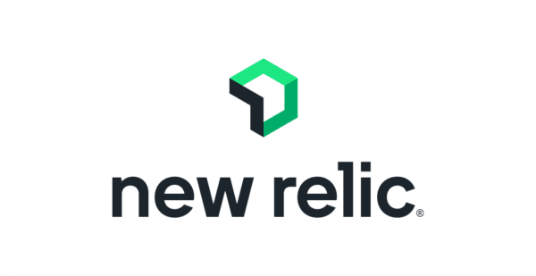
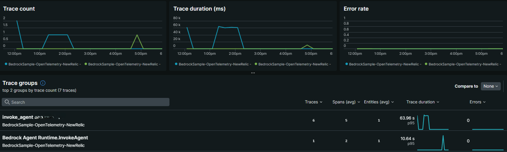
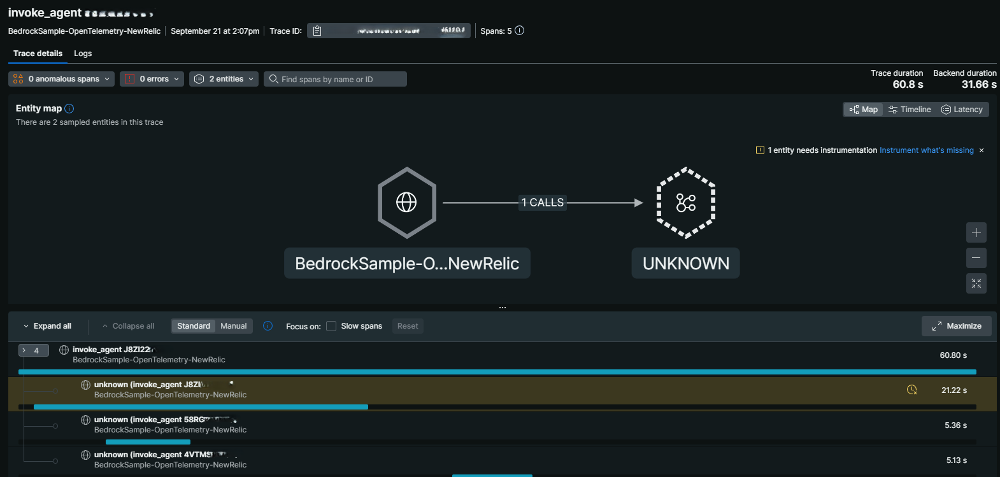

# Amazon Bedrock Agent Observability with OpenTelemetry on New Relic

An OpenTelemetry example to provide observability to AWS Bedrock Agents.

<div align="center">
    
</div>

## Signup New Relic

Create a [Free New Relic Account](https://newrelic.com/signup).
- Only your Email is required to create new account
- Up to 100 GB monthly
- 1 free user with access to everything and it has **no expiration date**
- No credit card required

### Preparation
1. A New Relic License key from the free account you made. How toget it: [New Relic API keys](https://docs.newrelic.com/docs/apis/intro-apis/new-relic-api-keys/?_gl=1*1ys60zo*_gcl_au*MTc2MDM1NTA4Mi4xNzU3OTQ1MjAw*_ga*MTQ3MTg1NTQxNC4xNzQ5NjQ4MjY3*_ga_R5EF3MCG7B*czE3NTg0NDI5MDQkbzEzJGcxJHQxNzU4NDQzMzA4JGo1NyRsMSRoMTA0Njk4OTYy)
    > -> OTEL_EXPORTER_OTLP_HEADERS
2. AWS account with appropriate IAM permissions for Amazon Bedrock Agents (or follow [AWS documentation](https://docs.aws.amazon.com/IAM/latest/UserGuide/access-keys-admin-managed.html) to create one)
    > -> AGENT_ID, AGENT_ALIAS_ID
3. An existing Amazon Bedrock Agent (or follow [AWS documentation](https://docs.aws.amazon.com/bedrock/latest/userguide/agents-create.html) to create one)
    > -> AGENT_ID, AGENT_ALIAS_ID

4. Insert your info about AWS access and New Relic account

    Update the *compose.yaml* file below, according to the key information you received at **Prerequisites**

    > /amazon-bedrock-agent-samples/examples/agent_observability/OpenTelemetry-NewRelic/newrelic-otlp/compose.yaml

    ```yaml
    services:
    python:
        build: python
        environment:
        ...
        - OTEL_EXPORTER_OTLP_HEADERS=api-key=INSERT_YOUR_NEWRELIC_INGUEST_LICENSE_KEY #Insert New Relic Info
        - AWS_ACCESS_KEY_ID=INSERT_YOUR_AWS_ACCESS_KEY_ID #Insert AWS Info
        - AWS_SECRET_ACCESS_KEY=INSERT_YOUR_AWS_SECRET_KEY_ID #Insert AWS Info
        - AGENT_ID=INSERT_BEDROCK_AGENT_ID #Insert AWS Bedrock agent Info
        - AGENT_ALIAS_ID=INSERT_BEDROCK_ALIAS_ID #Insert AWS Bedrock agent Info
        ...
    ```

## Run App and monitor Agents
1. Run *docker compose* and build a container 

    ```bash
    cd /amazon-bedrock-agent-samples/examples/agent_observability/OpenTelemetry-NewRelic/newrelic-otlp

    docker compose up --build
    ```

2. View the monitoring page of your New Relic account
    
    Check your [dashboard page](https://one.newrelic.com/nr1-core/distributed-tracing/distributed-trace-list).

    
    ---
    
    ---