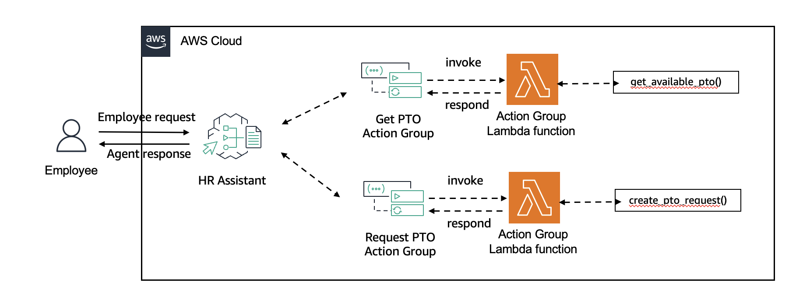
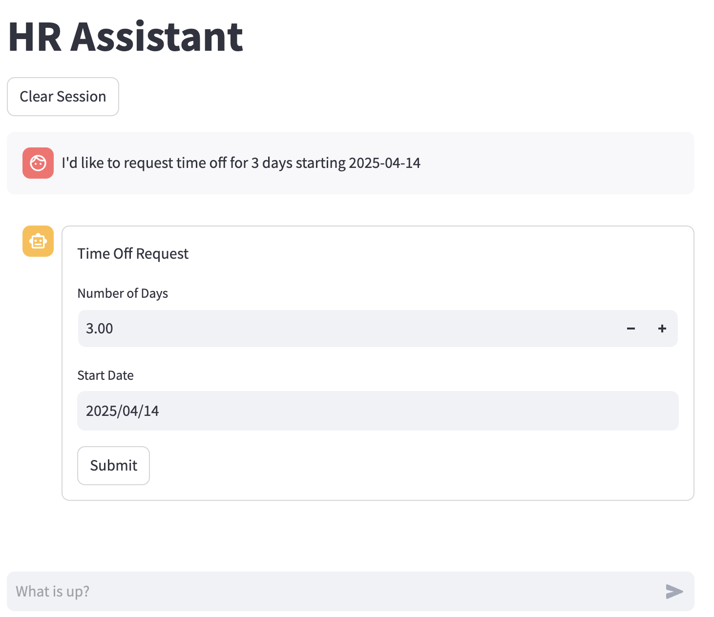

# Bedrock-HR-Assistant-ROC

## Purpose
This repo provides a backend for showcasing the human-in-the-loop capabilities in Amazon Bedrock, specifically focusing on Return of Control (ROC) functionality. This repo is for demonstrative purposes only, and the application code is not meant for production use.
The implementation demonstrates how to build intelligent HR assistants that can handle time-off requests with varying levels of human oversight.
This allows organizations to maintain appropriate control and verification of automated processes while leveraging AI capabilities.

The provided APIs demonstrate three key patterns:
* Direct automation without human intervention
* Confirmation-based workflows requiring human approval
* Return of Control (ROC) scenarios where human input or verification is needed

## Prerequisites
Before getting started, ensure you have the following installed:
* [Python 3.10+](https://www.python.org/downloads/)
* [Streamlit](https://docs.streamlit.io/library/get-started/installation)
* [AWS CLI](https://docs.aws.amazon.com/cli/latest/userguide/getting-started-install.html) configured with appropriate credentials and permissions
* [AWS CLI Environment Variable setup](https://docs.aws.amazon.com/cli/v1/userguide/cli-configure-envvars.html). Credentials used need to have permissions to CloudFormation, IAM, Bedrock, and Lambda. If you use PowerUser or Admin permissions, temporary credentials are recommended.
* [Bedrock Foundation model access](https://docs.aws.amazon.com/bedrock/latest/userguide/model-access.html). Ensure that you have access to Haiku 3.5 in `us-west-2` at a minimum.
* Using `us-west-2` is required to use Haiku 3.5 at the time of publishing. 

If you are new to Python, be sure to read through [venv documentation](https://docs.python.org/3/library/venv.html) as you will need to use this to deploy the agent using the CDK and run the frontend application locally.

## Deployment
The application consists of two main components that need to be deployed:

1. **Backend Infrastructure**
   * Navigate to the [CDK implementation](./cdk/README.md) for detailed deployment instructions
   * This will create the necessary AWS resources including Lambda functions and Bedrock Agent

2. **Frontend Application**
   * Follow the setup instructions in the [Frontend guide](./frontend/README.md)
   * This will deploy the Streamlit interface for interacting with the Bedrock Agent

## UI Preview
Once deployed, you'll be able to interact with an interface similar to the one shown below:

The interface supports three different interaction modes:

1. **Direct Processing**
   * Agent processes time-off requests automatically without human intervention
   * Suitable for straightforward requests within standard parameters

2. **Confirmation Required**
   * Agent presents the request details and waits for human confirmation
   * User must explicitly approve or reject the request before it's processed

3. **Return of Control (ROC)** (This mode is showcased in the image above)
   * Agent collects initial request details but returns control to the user
   * Allows modification of request parameters (dates, duration)
   * Final request is processed only after human review and adjustment

## Recommended Usage
1. Deploy the Amazon Bedrock Agent using the the [CDK implementation](./cdk/README.md) guide in the repo.
2. Confirm the default behavior of the agent in the AWS console by using a prompt like "I'd like to request time off for 3 days starting 2025-07-05."
3. Set up the frontend using the [Frontend guide](./frontend/README.md).
4. Update the Bedrock agent manually to use confirmation and/or return of control. See the [CDK implementation](../cdk/README.md#updating-agent-to-use-human-in-the-loop-capabilities) guide for more details.
5. Update the frontend environment variables and rerun. More details can be found in the [Frontend guide](./frontend/README.md).

## Next Steps
* Learn more about what other models are on [Amazon Bedrock](https://docs.aws.amazon.com/bedrock/latest/userguide/foundation-models-reference.html).
* Host your frontend on [AWS Amplify](https://docs.aws.amazon.com/amplify/latest/userguide/welcome.html).
* Implement Responsible AI on your Agent utilizing [Guardrails on Amazon Bedrock](https://docs.aws.amazon.com/bedrock/latest/userguide/guardrails.html).

## Clean Up
See [clean up](./cdk/README.md/#clean-up).