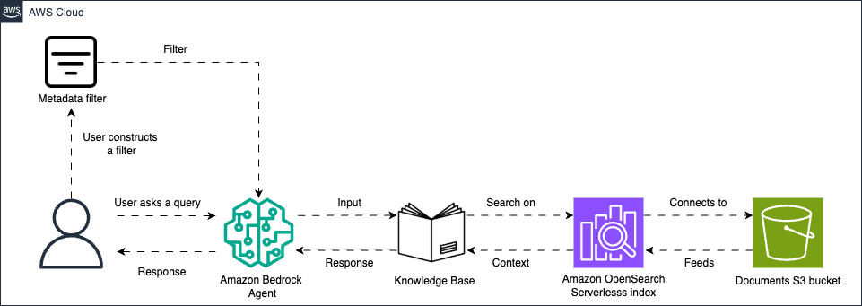
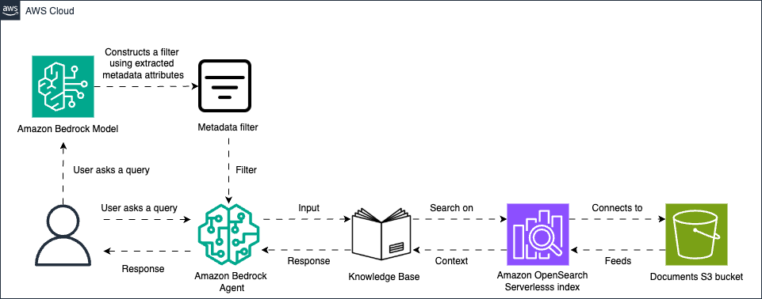

# Using metadata filtering with Amazon Bedrock Agents and Knowledge Bases

In this folder, we provide a set of examples of how to use metadata filtering with Amazon Bedrock Agents on your Amazon Knowledge Base. Using this integration, the agent will be able to respond to a user's query by using the metadata filtering feature for more accurate information retrieval from a knowledge base.

## Use Case

In this example, we will create a chatbot that allows employees of ExampleCompany to ask questions about their healthcare and finance information. The chatbot uses metadata filters to ensure the correct information is retrieved for each employee.

We provide 3 different implementations of metadata filtering:

1. Explicit metadata filtering

2. Intelligent metadata filtering custom approach

3. Implicit metadata filtering

## Agent Architecture

The agent architecture looks as follows:

**Method 1. Explicit metadata filtering**

The user provides a query and metadata filter to the Amazon Bedrock agent.

**Method 2. Intelligent metadata filtering custom approach**

The user provides the query to the Amazon Bedrock agent and the Amazon Bedrock model. The Amazon Bedrock model creates a metadata filter from the query and passes it to the Amazon Bedrock agent.

**Method 3. Implicit metadata filtering**

The user provides a query to the Amazon Bedrock agent and a metadata filter is created by the Amazon Bedrock agent.

