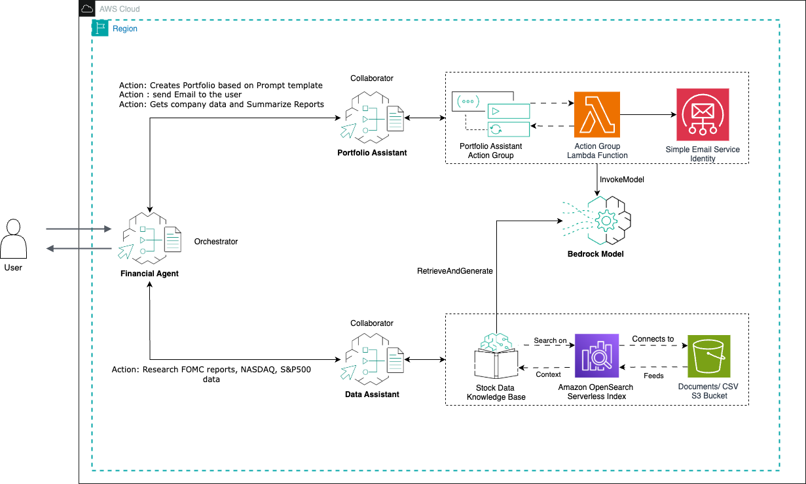

# Financial Analyst and Portfolio system - Multi-Agent Workshop

## Overview
This workshop showcases the new Amazon Bedrock Agents' [multi-agent collaboration capabilities](https://docs.aws.amazon.com/bedrock/latest/userguide/agents-multi-agents-collaboration.html) through an Energy Efficiency Management System. 
The system consists of a supervisor agent that orchestrates three specialized sub-agents, each handling specific aspects of energy management and customer service.

## System Architecture
```
├── 1- Portfolio Agent
├── 2- Knowledge Agent
├── 3- Financial Agent (Supervisor)
└── 4- Clean up# Financial Analyst and Portfolio system - Multi-Agent 
```

## Overview
This workshop showcases the new Amazon Bedrock Agents' [multi-agent collaboration capabilities](https://docs.aws.amazon.com/bedrock/latest/userguide/agents-multi-agents-collaboration.html) through an Energy Efficiency Management System. 
The system consists of a supervisor agent that orchestrates three specialized sub-agents, each handling specific aspects of energy management and customer service.

## Agents Description

### Financial Agent (Supervisor)
The supervisor agent coordinates the activities of two specialized sub-agents, 
routing customer queries and requests to the appropriate agent while maintaining context and 
ensuring seamless interactions. The architecture looks as following:




### Sub-Agents

#### 1. Portfolio Agent
The Portfolio Assistant Agent performs the following key functions:

* Creates a portfolio with static data that is present with the agent for companies and uses this to create detailed revenue details and other details for the past year. 
* Stakeholder communication management via email


#### 2. Knowledge Agent
The Data Assistant Agent functions as an information repository and data retrieval specialist. Its primary responsibilities include:

* Providing data-driven insights on economic trends, company financial statements, and Federal public documents (FOMC)
* Processing and responding to user queries regarding financial data like previous year revenue, stakeholder docs of the company for every fiscal quarter, etc. This is again just static data for the purpose of our experimentation; however, we can stream the real-time data using API’s available.


## Prerequisites
- AWS Account with appropriate permissions
- Amazon Bedrock access
- Basic understanding of AWS services
- Python 3.8+
- Latest Boto3 SDK
- AWS CLI configured

## Getting Started
1. Clone this repository
```bash
git clone 
```

2. Install dependencies
```bash
pip install -r requirements.txt
```

3. Follow the setup instructions in the workshop guide

## Security

See [CONTRIBUTING](CONTRIBUTING.md#security-issue-notifications) for more information.

## License
This project is licensed under the MIT-0 License - see the LICENSE file for details.

## Support
For support and questions, please open an issue in the repository.

---
Note: This workshop is for educational purposes and demonstrates the capabilities of Amazon Bedrock Agents' multi-agent collaboration feature.

