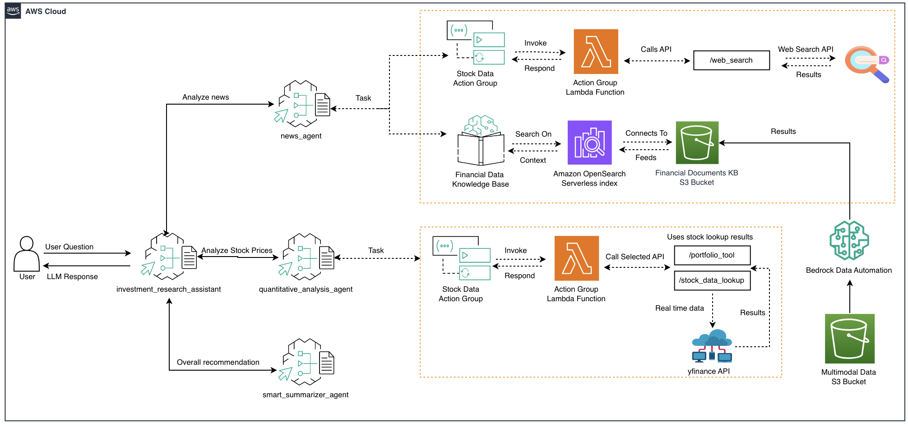

# Investment Research Assistant Agent

Investment Research supervisor agent has three collaborators, a News agent, a Quantitative Analysis Data agent, and a Smart Summarizer agent. These specialists are orchestrated to perform investment analysis for a given stock ticker based on the latest news and recent stock price movements. 

## Architecture Diagram




## Prerequisites

1. Open a terminal then clone and install repository, setup environment

```bash
git clone https://github.com/awslabs/amazon-bedrock-agent-samples

cd amazon-bedrock-agent-samples

python3 -m venv .venv

source .venv/bin/activate

pip3 install -r src/requirements.txt
```

2. Deploy Web Search tool. You will be required to make a [Tavilly API](https://docs.tavily.com/docs/gpt-researcher/getting-started) key.

Follow instructions [here](/src/shared/web_search/).

3. Deploy Stock Data Lookup and Portfolio Optimization tool. This stack may take ~5 minutes to deploy.

Follow instructions [here](/src/shared/stock_data/).


### For [main.ipynb](./main.ipynb)

Run through the cells in the notebook, attach appropriate permissions as needed. For this notebook, you may attach the following IAM policy to the appropriate execution role to run through the notebook. This IAM policy is highly permissive and grants full access to multiple critical AWS services including IAM, S3, Lambda, DynamoDB, and Bedrock. It should only be used for quick prototyping or development in isolated, non-production environments:


```bash
{
  "Version": "2012-10-17",
  "Statement": [
    {
      "Sid": "AllowAllBedrockActions",
      "Effect": "Allow",
      "Action": "bedrock:*",
      "Resource": "*"
    },
    {
      "Sid": "AllowAllS3Actions",
      "Effect": "Allow",
      "Action": "s3:*",
      "Resource": "*"
    },
    {
      "Sid": "AllowAllAOSSActions",
      "Effect": "Allow",
      "Action": "aoss:*",
      "Resource": "*"
    },
    {
      "Sid": "AllowAllIAMActions",
      "Effect": "Allow",
      "Action": "iam:*",
      "Resource": "*"
    },
    {
      "Sid": "AllowAllDynamoDBActions",
      "Effect": "Allow",
      "Action": "dynamodb:*",
      "Resource": "*"
    },
    {
      "Sid": "AllowAllLambdaActions",
      "Effect": "Allow",
      "Action": "lambda:*",
      "Resource": "*"
    },
    {
      "Sid": "AllowSTSCallerIdentity",
      "Effect": "Allow",
      "Action": "sts:GetCallerIdentity",
      "Resource": "*"
    }
  ]
}

```

For more information on creating IAM policies, check out our [documentation](https://docs.aws.amazon.com/IAM/latest/UserGuide/access_policies_create-console.html)

## License

This project is licensed under the Apache-2.0 License.
