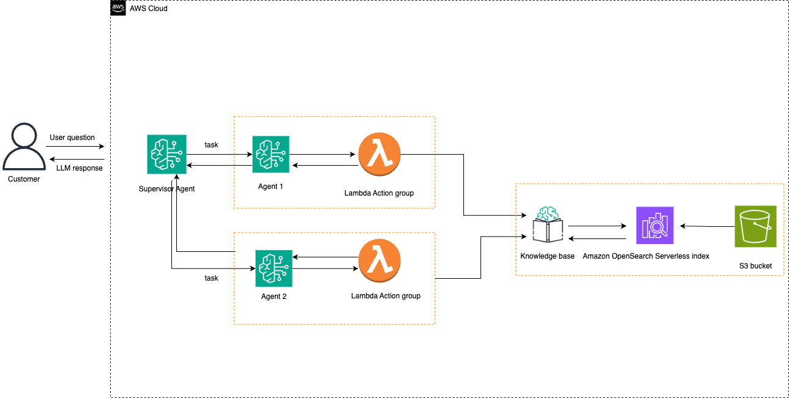

# Amazon Bedrock Multi Agent with metadtafiltering

This project demonstrates how to create an Amazon Bedrock Mult-Agent setup that can answer questions from multiple documents using a Lambda Action group, with separate agents handling different documents from the same Knowledgebase. The architecture utilized action groups to use RetrieveAndGenerate API call with metadata filtering.

## Architecture Overview

## Architecture


The solution consists of:
- An Orchestrator Agent that routes queries to appropriate sub-agents
- Two sub-agents (Agent1 and Agent2) handling different document years
- A Lambda function acting a an Action Group in both sub agents, that processes queries using Bedrock Knowledge Base's RetrieveAndGenerate API call.
- A Knowledge Base containing the shareholder letters and the metadata json file for each letter.

## Prerequisites

- AWS Account with appropriate permissions
- Python 3.11 or later
- AWS CLI configured with appropriate credentials
- The following AWS services enabled:
  - Amazon Bedrock
  - AWS Lambda
  - IAM
  - Amazon S3

## Required Documents

Place the following documents in your S3 bucket:
- AMZN-2020-Shareholder-Letter.pdf
- Amazon-com-Inc-2023-Shareholder-Letter.pdf


## Setup Instructions

1. Clone and install repository
```
git clone https://github.com/awslabs/amazon-bedrock-agent-samples

cd amazon-bedrock-agent-samples

python3 -m venv .venv

source .venv/bin/activate

pip3 install -r src/requirements.txt

cd examples/multi_agent_collaboration/metadata_filtering/

pip3 install -r requirements.txt
```


2. Create a bucket
```aws s3 mb s3://<your bucket name>```

3. Download shareholder letters and copy them to the S3 bucket created
```python data_source_creation.py```

```aws s3 cp ./data_sources/ s3://BUCKET_NAME/data_sources/ --recursive```


4. Configure environment variables:
```
export AWS_PROFILE=your-profile
export AWS_REGION=your-region
export S3_BUCKET_NAME=your-bucket-name
```


5. Deploy the solution:
```
python setup_agents.py --bucket <your bucket name> --account-id <your account ID> 
```
Keep note of the orchestrator's ID and aliad ID since we will need to use it in the next step

6. Test the Solution:

```
python invoke_agent.py --agent-id <your agent ID> --agent-alias-id <your agent alias ID> --query "<your query>" 
```

Replace the agent Id and Agent Alias ID with the info returned in Step #3.


7. Project Structure
.
├── README.md
├── requirements.txt
├── knowledge_base_helper.py
├── setup_agents.py
├── data_souoce_creation.py
├── openapi_schema.yaml
|── invoke_agent.py/
└── data_sources/
    └── Amazon-com-Inc-2023-Shareholder-Letter.pdf
    └── Amazon-com-Inc-2023-Shareholder-Letter.pdf.metadata.json
    └── AMZN-2020-Shareholder-Letter.pdf
    └── AMZN-2020-Shareholder-Letter.pdf.metadata.json


## Clean up:

To clean up ONLY the resources created, run the below command.
```
python cleanup.py --bucket <your bucket> --account-id <your account ID>
```
* Note that the regions is set to the region you configure, to check your region run ```aws configure```
* Note passing your bucket name does not necessarily mean the bucket will be deleted. If you wish to delete the bucket, in delete_knowledge_base function in cleanup.py script, set the following:

```
delete_s3_bucket=True
```

## Contributers:
[x] Omar Elkharbotly
[x] Anna Gruebler
[x] Maira Ladeira Tanke