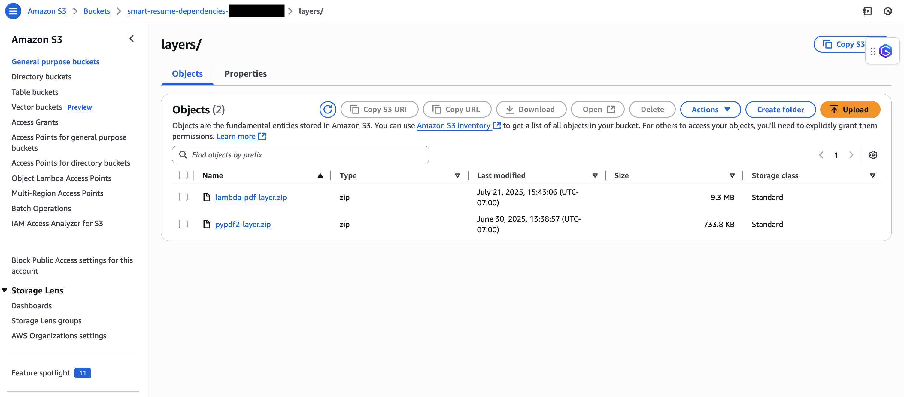
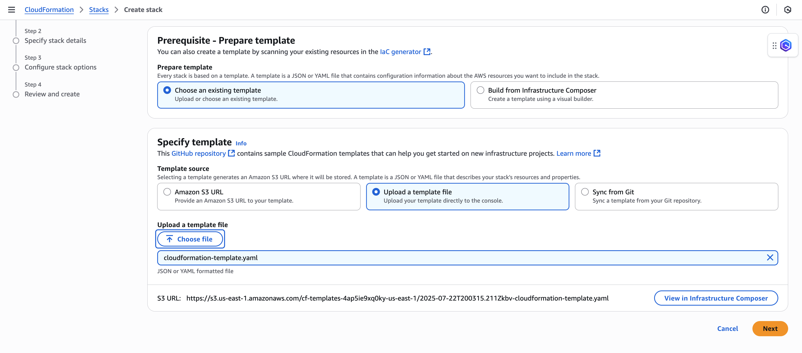
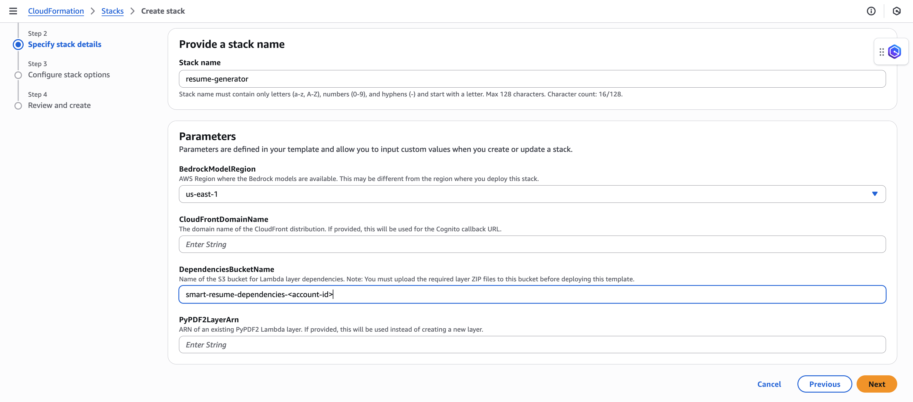
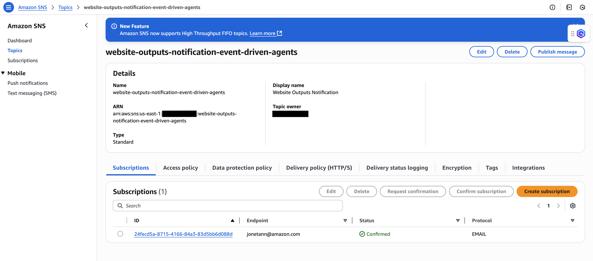
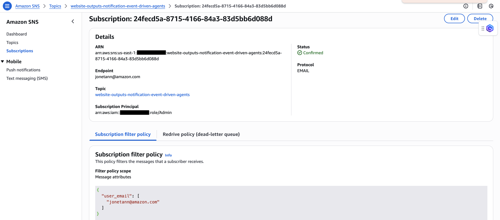

# Profile & Resume Builder

A full-stack web application that allows users to upload their resumes, manage their profiles, and generate AI-enhanced resume content using AWS services.

## 🚀 Features

- **User Authentication**: Secure sign-in/sign-up using AWS Cognito
- **Profile Management**: Create and manage personal profiles with job objectives
- **Resume Upload**: Upload PDF resumes to secure cloud storage
- **AI Resume Generation**: Generate enhanced resume content using AI models
- **Resume Preview**: View uploaded and generated resumes directly in the browser
- **Secure Downloads**: Download resumes with time-limited secure URLs
- **Real-time Processing**: Track AI processing status with progress indicators
- **Responsive Design**: Mobile-friendly interface with expandable sections

## 🏗️ Architecture

### Frontend
- **HTML5/CSS3/JavaScript**: Single-page application with modern UI
- **AWS SDK for JavaScript**: Direct integration with AWS services
- **Progressive Web App**: Responsive design with mobile support

### Backend (AWS Serverless)
- **AWS API Gateway**: RESTful API endpoints with JWT authentication
- **AWS Lambda**: Serverless functions for business logic
- **AWS Cognito**: User authentication and authorization
- **Amazon S3**: Secure file storage for resumes
- **Amazon DynamoDB**: User profile and metadata storage
- **AWS Bedrock**: AI model integration for resume enhancement

### Infrastructure
- **AWS CloudFormation**: Infrastructure as Code (IaC)
- **Amazon CloudFront**: Global content delivery network
- **AWS IAM**: Fine-grained access control

## 📋 Prerequisites

- AWS Account with appropriate permissions
- AWS CLI configured
- Basic understanding of AWS services
- Modern web browser with JavaScript enabled
- **Model Access**: Request access to Claude 3.7 models in US East 1 region via AWS Bedrock console

## 🛠️ Installation & Deployment

### 1. Prepare Lambda Layers
Upload the required Lambda layers to an S3 bucket:
- Use zip files: `lambda-pdf-layer.zip` and `pypdf2-layer.zip`
- Upload to S3 bucket under `layers/` folder


*Lambda layer zip files uploaded to S3 bucket under layers/ folder*

### 2. Deploy CloudFormation Stack
Deploy the infrastructure using AWS Console in US East 1 region:
- Navigate to CloudFormation in AWS Console (ensure you're in us-east-1 region)
- Create new stack using `cloudformation-template.yaml`


*Upload the CloudFormation template in the AWS Console*


*Configure stack name and S3 bucket with Lambda layers*

### 3. Configure Frontend
Upload the frontend to the created S3 bucket and configure variables:
- Navigate to S3 Console
- Find bucket named `smart-job-resume-<accountID>`
- Upload `index.html` file to the bucket
- Configure these variables using the outputs information from the CloudFormation template:

```javascript
const userclient = '<example>';
const userpool = 'us-east-1_<example>';
const baseUrl = 'https://<example>.execute-api.us-east-1.amazonaws.com';
const cognitoDomain = 'https://auth-event-driven-agents-<ACCOUNT_ID>.auth.us-east-1.amazoncognito.com';
const redirectUri = 'https://<example>.cloudfront.net';
```

#### Local Testing
To test the application locally before deployment:
1. Navigate to the directory containing `index.html`
2. Start a Python HTTP server:
   ```bash
   python -m http.server
   ```
3. Open your browser and go to `http://localhost:8000`
4. The application will be served locally for testing

### 4. Configure SNS Notifications
Set up SNS filter policy for email notifications:
- Navigate to SNS in AWS Console
- Find the created SNS topic


*Locate the SNS topic in the AWS Console*

- Add subscription filter policy:
```json
{
  "user_email": [
    "your-email@domain.com"
  ]
}
```


*Configure the SNS filter policy with your email*

## 🔧 Configuration

### Required Lambda Layers
The application requires these Lambda layers:
- `lambda-pdf-layer.zip`: PDF processing libraries
- `pypdf2-layer.zip`: PyPDF2 library for PDF manipulation

### Environment Variables
The Lambda functions use these environment variables:
- `BUCKET_NAME`: S3 bucket for file storage
- `TABLE_NAME`: DynamoDB table name
- `COGNITO_USER_POOL_ID`: Cognito User Pool ID

### API Endpoints

| Method | Endpoint | Description |
|--------|----------|-------------|
| POST | `/profile` | Save user profile |
| POST | `/get-profile` | Retrieve user profile |
| POST | `/get-upload-url` | Get S3 presigned upload URL |
| POST | `/get-resume-url` | Get S3 presigned download URL |
| POST | `/generate` | Trigger AI resume generation |
| POST | `/list-generated-resumes` | List user's generated resumes |

## 📱 Usage

### Getting Started
1. **Sign Up**: Create a new account or sign in with existing credentials
2. **Complete Profile**: Fill in your personal information and job objectives
3. **Upload Resume**: Upload your current resume in PDF format
4. **Generate Content**: Use AI to enhance your resume content
5. **Preview & Download**: View and download your resumes

### Key Features

#### Profile Management
- Save personal information (name, email, objectives)
- Data synced between local storage and cloud
- Automatic profile loading on sign-in

#### Resume Upload
- Drag-and-drop PDF upload
- Secure S3 storage with user-specific folders
- Automatic file validation and processing

#### AI Generation
- Real-time processing status with progress bar
- Enhanced resume content based on your profile and uploaded resume
- Multiple generated versions stored separately

#### Resume Management
- Preview resumes directly in the browser
- Secure download with time-limited URLs
- Organized view of uploaded and generated resumes

## 🔒 Security Features

- **JWT Authentication**: Secure API access with Cognito tokens
- **User Isolation**: Each user can only access their own data
- **Presigned URLs**: Time-limited access to S3 objects
- **Input Validation**: Server-side validation of all inputs
- **CORS Protection**: Proper cross-origin resource sharing configuration

## 🏢 AWS Services Used

| Service | Purpose |
|---------|---------|
| **Cognito** | User authentication and management |
| **API Gateway** | RESTful API with JWT authorization |
| **Lambda** | Serverless business logic |
| **S3** | File storage and static website hosting |
| **DynamoDB** | User profile and metadata storage |
| **CloudFront** | Content delivery network |
| **Bedrock** | AI model integration |
| **IAM** | Access control and permissions |
| **CloudFormation** | Infrastructure deployment |

## 📊 File Structure

```
resume_generator/
├── index.html # Main application file
├── cloudformation-template.yaml # Infrastructure as Code
├── images/ # Screenshots and documentation images
│   ├── image_1.png
│   ├── image_2.png
│   ├── image_3.png
│   ├── image_4.png
│   └── image_5.png
├── layers/ # Lambda layer zip files
│   ├── lambda-pdf-layer.zip
│   └── pypdf2-layer.zip
└── README.md # This file
```

## 🔄 Data Flow

1. **User Authentication**: Cognito handles sign-in/sign-up
2. **Profile Management**: Data stored in DynamoDB, cached locally
3. **File Upload**: Frontend → API Gateway → Lambda → S3
4. **AI Processing**: Lambda triggers Bedrock models for content generation
5. **File Access**: Presigned URLs provide secure, time-limited access

## 🚨 Troubleshooting

### Common Issues

**Authentication Errors**
- Verify Cognito configuration in frontend
- Check JWT token expiration
- Ensure proper CORS settings

**Upload Failures**
- Verify S3 bucket permissions
- Check file size limits (default: 10MB)
- Ensure proper content-type headers

**AI Generation Issues**
- Check Bedrock model availability in your region
- Verify IAM permissions for Bedrock access
- Monitor Lambda function logs

### Monitoring & Logs
- **CloudWatch Logs**: Monitor Lambda function execution
- **API Gateway Logs**: Track API request/response patterns
- **S3 Access Logs**: Monitor file upload/download activity

## 🤝 Contributing

1. Fork the repository
2. Create a feature branch (`git checkout -b feature/amazing-feature`)
3. Commit your changes (`git commit -m 'Add amazing feature'`)
4. Push to the branch (`git push origin feature/amazing-feature`)
5. Open a Pull Request

## 📄 License

This project is licensed under the MIT License - see the [LICENSE](LICENSE) file for details.

## 🆘 Support

For support and questions:
- Create an issue in the GitHub repository
- Check AWS documentation for service-specific questions
- Review CloudWatch logs for debugging

---

**Built with ❤️ using AWS Serverless Technologies**