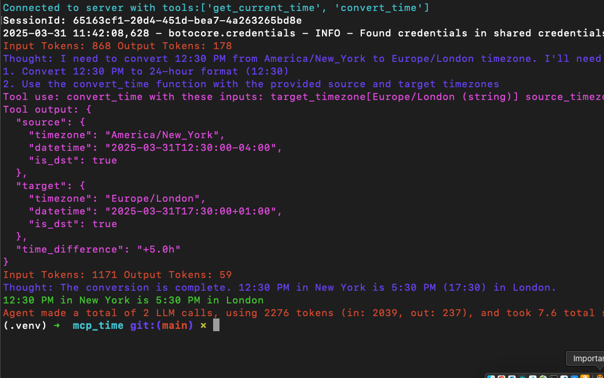

<h1 align="center">Amazon Bedrock Inline Agent SDK&nbsp;</h1>

<p align="center">
  <a href="./README.md/#getting-started-with-model-context-protocol"></a>
  <a href="./README.md/#observability-for-amazon-bedrock-agents"></a>
  <a href="./README.md/#observability-for-amazon-bedrock-agents"></a>
  <a href="./README.md/#example-agents"></a>
  <a href="./README.md/#example-agents"></a>
</p>

> [!NOTE]  
> Configuring and invoking an inline agent feature is in preview release for Amazon Bedrock and is subject to change.
> Amazon Bedrock Inline Agent SDK is currently in beta.

- Use Model Context Protocol (MCP) servers [1](https://github.com/modelcontextprotocol/servers) [2](https://github.com/punkpeye/awesome-mcp-servers) to orchestrate agentic workflows on Amazon Bedrock.
- Monitor and evaluate your Amazon Bedrock Agent response with `@observe` decorater on [langfuse](https://github.com/langfuse/langfuse) and [phoenix](https://phoenix.arize.com/).
- Ability to use local implementations of tools with Amazon Bedrock Agents - no AWS Lambda required.
- Take advantage of [CrewAI Tookit](https://github.com/crewAIInc/crewAI-tools) and [Langchain Tools](https://python.langchain.com/docs/integrations/tools/) with Amazon Bedrock Agents.
- Easy implementation with [Amazon Bedrock Knowledge](https://aws.amazon.com/bedrock/knowledge-bases/) for Retrieval Augmented Generation (RAG) and [Amazon Bedrock Guardrails](https://aws.amazon.com/bedrock/guardrails/).
- Give your agents capability to write and execute code using [code interpreter](https://docs.aws.amazon.com/bedrock/latest/userguide/agents-code-interpretation.html).
- Automate UI related tasks using computer use [1](https://docs.aws.amazon.com/bedrock/latest/userguide/computer-use.html) [2](https://aws.amazon.com/blogs/machine-learning/getting-started-with-computer-use-in-amazon-bedrock-agents/).

```python
from InlineAgent.agent import InlineAgent
from InlineAgent.action_group import ActionGroup

import asyncio

# Step 1: Define tools with Docstring
def get_current_weather(location: str, state: str, unit: str = "fahrenheit") -> dict:
    """
    Get the current weather in a given location.

    Parameters:
        location: The city, e.g., San Francisco
        state: The state eg CA
        unit: The unit to use, e.g., fahrenheit or celsius. Defaults to "fahrenheit"
    """
    return "Weather is 70 fahrenheit"

# Step 2: Logically group tools together
weather_action_group = ActionGroup(
    name="WeatherActionGroup",
    description="This is action group to get weather",
    tools=[get_current_weather],
)

# Step 3: Define agent 
agent = InlineAgent(
    foundation_model="us.anthropic.claude-3-5-haiku-20241022-v1:0",
    instruction="You are a friendly assistant that is responsible for getting the current weather.",
    action_groups=[weather_action_group],
    agent_name="MockAgent",
)

# Step 4: Invoke agent
asyncio.run(agent.invoke(input_text="What is the weather of New York City, NY?"))
```

## �� Table of Contents ��

- [Amazon Bedrock Inline Agent vs Amazon Bedrock Agent](#amazon-bedrock-inline-agent-vs-amazon-bedrock-agent)
- [Why Amazon Bedrock Inline Agent SDK?](#why-amazon-bedrock-inline-agent-sdk)
- [Getting Started](#getting-started)
- [Getting started with Model Context Protocol](#getting-started-with-model-context-protocol)
- [Observability for Amazon Bedrock Agents](#observability-for-amazon-bedrock-agents)
- [Example Agents](#example-agents)
- [Roadmap Features](#roadmap-features)
- [License](#license)

## Amazon Bedrock Inline Agent vs Amazon Bedrock Agent

You can configure and invoke an inline Amazon Bedrock agent dynamically at runtime using [InvokeInlineAgent](https://docs.aws.amazon.com/bedrock/latest/APIReference/API_agent-runtime_InvokeInlineAgent.html) API. Using an inline agent provides you with flexibility to specify your agent capabilities like foundation models, instructions, action groups, guardrails, and knowledge bases at the same time you invoke your agent.

## Why Amazon Bedrock Inline Agent SDK?

## Getting Started

### Prerequisites

1. AWS Command Line Interface (CLI), follow instructions [here](https://docs.aws.amazon.com/cli/latest/userguide/getting-started-install.html). Make sure to setup credentials, follow instructions [here](https://docs.aws.amazon.com/cli/latest/userguide/getting-started-quickstart.html).
2. Require [Python 3.11](https://www.python.org/downloads/) or later.
3. AWS CDK CLI, follow instructions [here](https://docs.aws.amazon.com/cdk/v2/guide/getting_started.html).
4. Enable [model access](https://docs.aws.amazon.com/bedrock/latest/userguide/model-access.html).

### Setup

```bash
git clone https://github.com/awslabs/amazon-bedrock-agent-samples.git
cd src/InlineAgnet

python -m venv .venv
source .venv/bin/activate

python -m pip install -e .

InlineAgent_hello us.anthropic.claude-3-5-haiku-20241022-v1:0
```

## Getting started with Model Context Protocol

### Using MCP servers

```python
InlineAgent(
    # 1: Provide the model
    foundation_model="us.anthropic.claude-3-5-sonnet-20241022-v2:0",
    # 2: Concise instruction
    instruction="""You are a friendly assistant that is responsible for resolving user queries. """,
    # Step 3: Provide the agent name and action group
    agent_name="SampleAgent",
    action_groups=[
        ActionGroup(
            name="SampleActionGroup",
            mcp_clients=[mcp_client_1, mcp_client_2],
        )
    ],
)
```

### Example

```python
from mcp import StdioServerParameters

from InlineAgent.tools import MCPStdio
from InlineAgent.action_group import ActionGroup
from InlineAgent.agent import InlineAgent

# Step 1: Define MCP stdio parameters
server_params = StdioServerParameters(
    command="docker",
    args=["run", "-i", "--rm", "mcp/time"],
)

async def main():
    # Step 2: Create MCP Client
    time_mcp_client = await MCPStdio.create(server_params=server_params)
    
    try:
        # Step 3: Define an action group
        time_action_group = ActionGroup(
            name="TimeActionGroup",
            description="Helps user get current time and convert time.",
            mcp_clients=[time_mcp_client],
        )
        
        # Step 4: Invoke agent 
        await InlineAgent(
            # Step 4.1: Provide the model
            foundation_model="us.anthropic.claude-3-5-sonnet-20241022-v2:0",
            # Step 4.2: Concise instruction
            instruction="""You are a friendly assistant that is responsible for resolving user queries. """,
            # Step 4.3: Provide the agent name and action group
            agent_name="time_agent",
            action_groups=[time_action_group],
        ).invoke(input_text="Convert 12:30pm to Europe/London timezone? My timezone is America/New_York")
    
    finally:
        
        await time_mcp_client.cleanup()

if __name__ == "__main__":
    import asyncio

    asyncio.run(main())
```

<details>
<summary>
<h2>Example Response<h2>
</summary>
  
</details>

## Observability for Amazon Bedrock Agents

```python
import os
import uuid
from InlineAgent.observability import observe
import boto3
from dotenv import load_dotenv

from InlineAgent.observability import AppConfig
from InlineAgent.observability import create_tracer_provider


@observe(show_traces=True, save_traces=False)
def invoke_bedrock_agent(inputText: str, sessionId: str, **kwargs):
    """Invoke a Bedrock Agent with instrumentation"""

    # Create Bedrock client
    profile = kwargs.pop("profile", "default")

    bedrock_agent_runtime = boto3.Session(profile_name=profile).client(
        "bedrock-agent-runtime"
    )

    # Invoke the agent with the appropriate configuration
    response = bedrock_agent_runtime.invoke_agent(
        inputText=inputText, sessionId=sessionId, **kwargs
    )

    return response


if __name__ == "__main__":

    config = AppConfig()  # Load .env variables

    create_tracer_provider(config=config, timeout=300)

    load_dotenv()

    agentId = os.environ.get("AGENT_ID")
    agentAliasId = os.environ.get("AGENT_ALIAS_ID")

    user_id = "multiagent-test"

    question = "Can you give me my past energy consumption? What is my average spending on summer months? Use code interpreter to visulize the result. My customer id is 1"

    sessionId = f"session-{str(uuid.uuid4())}"  # Dynamic session ID

    # Tags for filtering in Langfuse
    tags = ["bedrock-agent", "example", "development"]

    stream_final_response = True

    enable_trace = True  # Required for observability

    # Single invocation that works for both streaming and non-streaming
    agent_answer = invoke_bedrock_agent(
        agentId=agentId,
        agentAliasId=agentAliasId,
        inputText=question,
        sessionId=sessionId,
        enableTrace=enable_trace,
        streamingConfigurations={"streamFinalResponse": stream_final_response},
        user_id=user_id,
        tags=tags,
    )

```

## Example Agents

> [!CAUTION]
> The examples provided in this repository are for experimental and educational purposes only. They demonstrate concepts and techniques but are not intended for direct use in production environments. Make sure to have Amazon Bedrock Guardrails in place to protect against [prompt injection](https://docs.aws.amazon.com/bedrock/latest/userguide/prompt-injection.html).

- Features
    1. KnowledgeBase plugin
    2. User confirmation before invoking tools
    3. Guardrails
    4. Multi-Agent collaboration
    5. Code interpreter
    6. Computer use

- MCP
    1. Cost explorer MCP server and code interpreter
    2. Perplexity MCP server
    3. KnowledgeBase Retrieve MCP Server

- Langchain Tools
    1. GitHub Toolkit

- Crew Ai Tools
    1. Spider Tool
    2. Chroma database

## Roadmap Features

- [Multi Agent collaboration](https://aws.amazon.com/blogs/machine-learning/amazon-bedrock-announces-general-availability-of-multi-agent-collaboration/) compatibility of Supervisor and Supervisor with routing mode.
- [langfuse](https://github.com/langfuse/langfuse) and [Phoeniz](https://phoenix.arize.com/) compatibility with `InvokeInlineAgent`API.
- Better console traces for `InvokeInlineAgent` and `InvokeAgent` API.
- MCP catalog and ability to dynamically choose MCP servers at runtime.
- Replace HTTP+SSE with new "Streamable HTTP" transport for MCP compatibility, see information [here](https://github.com/modelcontextprotocol/specification/pull/206).
- Ready to use Amazon Bedrock Guardrails.
- Script to manage creation of Amazon Bedrock Knowledge Bases and Amazon Bedrock Guardrails.
- Documentation for InlineAgent SDK.
- Publish to PyPI.

## Related Links

- [Build a dynamic, role-based AI agent using Amazon Bedrock inline agents](https://aws.amazon.com/blogs/machine-learning/build-a-dynamic-role-based-ai-agent-using-amazon-bedrock-inline-agents/)
- [Create Dynamic Tooling Inline Agents](https://aws-samples.github.io/amazon-bedrock-samples/agents-and-function-calling/bedrock-agents/features-examples/15-invoke-inline-agents/inline-agent-api-usage/)

## License

This project is licensed under the Apache-2.0 License.