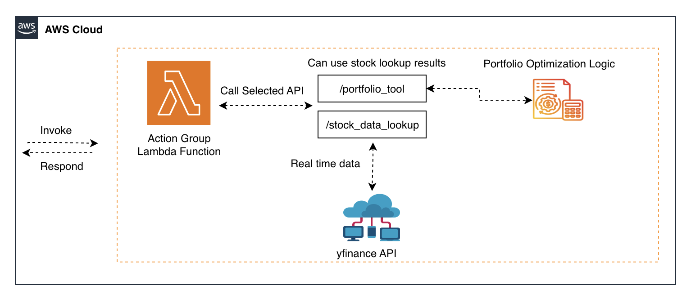

# Stock Data Lookup Tool

To demonstrate use of a Bedrock Agents Action Group as a reusable tool across multiple Bedrock Agents, here we have created a lightweight StockData tool. It is able to take a stock ticker and return stock price history data by leveraging Yahoo Finance (hyperlink here). It can be easily extended to cover many other functions as well. The [Portfolio Assistant Agent](/examples/multi_agent_collaboration/portfolio_assistant_agent/) supervisor example demonstrates reusing this StockData tool. Note the implementation of the Lambda function currently ignores which Agent was used to call the Action Group and is not tightly coupled to any single Agent.

This tool consists of an AWS Lambda function named "stock_data_lookup" to retrieve stock data using the yfinance Python library. The "stock_data_lookup" Lambda function can then be invoked to retrieve stock data for a given ticker symbol. Here's a breakdown:

- **AgentLambdaFunction**: This AWS Lambda function implements the stock_data_lookup and portfolio_optimization functionalities. It uses a Python 3.12 container image with all dependencies packaged at build time.
- **AgentLambdaRole**: This is an AWS Identity and Access Management (IAM) role that grants the Lambda function the necessary permissions to execute.
- **AgentAliasLambdaPermission** and **AgentLambdaPermission**: These resources grant permissions for Amazon Bedrock Agents to invoke the Lambda function.



## Deploy [stock_data_stack.yaml](/src/shared/stock_data/cfn_stacks/stock_data_stack.yaml)

|   Region   | development.yaml |
| ---------- | ----------------- |
| us-east-1  | [](https://console.aws.amazon.com/cloudformation/home?region=us-east-1#/stacks/new?stackName=StockDataLookup&templateURL=https://ws-assets-prod-iad-r-iad-ed304a55c2ca1aee.s3.us-east-1.amazonaws.com/1031afa5-be84-4a6a-9886-4e19ce67b9c2/tools/stock_data_stack.yaml)|
| us-west-2  | [](https://console.aws.amazon.com/cloudformation/home?region=us-west-2#/stacks/new?stackName=StockDataLookup&templateURL=https://ws-assets-prod-iad-r-pdx-f3b3f9f1a7d6a3d0.s3.us-west-2.amazonaws.com/1031afa5-be84-4a6a-9886-4e19ce67b9c2/tools/stock_data_stack.yaml)|


## Usage

```python
from src.utils.bedrock_agent import (
    Agent,
    region,
    account_id,
)
import uuid

stock_data_tools_arn = f"arn:aws:lambda:{region}:{account_id}:function:stock_data_tools"

quantitative_analysis_agent = Agent.create(
    name="quantitative_analysis_agent",
    role="Financial Data Collector",
    goal="Retrieve real-time and historic stock prices as well as optimizing a portfolio given tickers.",
    instructions="""You are a Stock Data and Portfolio Optimization Specialist...
""",
    tools=[
        # Stock Data Lookup Tool
        {
            "code": stock_data_tools_arn,
            "definition": {
                "name": "stock_data_lookup",
                "description": "Gets the 1-month stock price history for a given stock ticker, formatted as JSON.",
                "parameters": {
                    "ticker": {"description": "The ticker to retrieve price history for", "type": "string", "required": True}
                },
            },
        },
        # Portfolio Optimization Tool
        {
            "code": stock_data_tools_arn,
            "definition": {
                "name": "portfolio_optimization",
                "description": "Optimizes a stock portfolio given a list of tickers and historical prices from the stock_data_lookup function.",
                "parameters": {
                    "tickers": {
                        "description": "A comma-separated list of stock tickers to include in the portfolio",
                        "type": "string",
                        "required": True
                    },
                    "prices": {
                        "description": "A JSON object with dates as keys and stock prices as values",
                        "type": "string",
                        "required": True
                    }
                }
            },
        }
    ],
    llm=LLM,
)

response1 = stock_data_agent.invoke(   #invoking stock_data_lookup
    input_text="What is the stock trend for AMZN?",
    session_id: str = str(uuid.uuid1()),
    enable_trace: bool = False,
)
print(response1)

response2 = stock_data_agent.invoke(   #invoking portfolio_optimization
    input_text= "Optimize a portfolio for the following: {\"2025-03-01\": {\"FAKE1\": 100.0, \"FAKE2\": 200.0, \"FAKE3\": 300.0}, \"2025-03-02\": {\"FAKE1\": 101.0, \"FAKE2\": 201.0, \"FAKE3\": 301.0}, \"2025-03-03\": {\"FAKE1\": 102.0, \"FAKE2\": 202.0, \"FAKE3\": 302.0}}",
    session_id: str = str(uuid.uuid1()),
    enable_trace: bool = False,
)
print(response2)

response3 = stock_data_agent.invoke(   #invoking both tools
    input_text="Optimize a portfolio with AMZN, GOOG, and MSFT",
    session_id: str = str(uuid.uuid1()),
    enable_trace: bool = False,
)
print(response3)
```

## Clean Up

- Open the CloudFormation console.
- Select the stack `StockDataLookup` you created, then click **Delete**. Wait for the stack to be deleted.

See [CONTRIBUTING](CONTRIBUTING.md#security-issue-notifications) for more information.

## License

This project is licensed under the Apache-2.0 License.s

